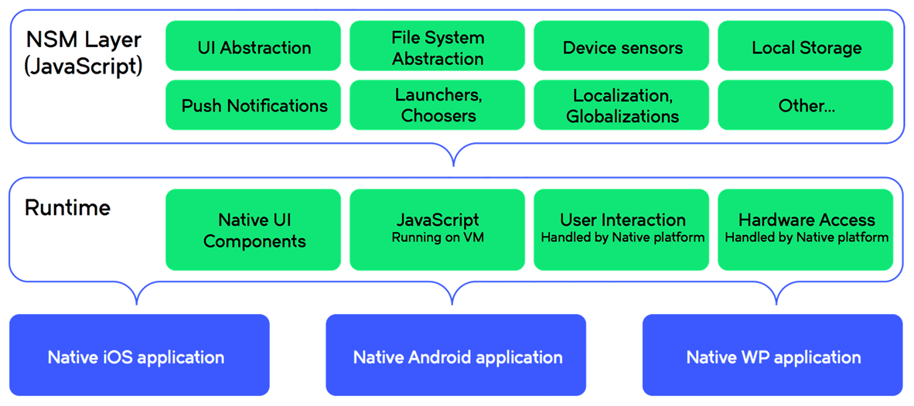
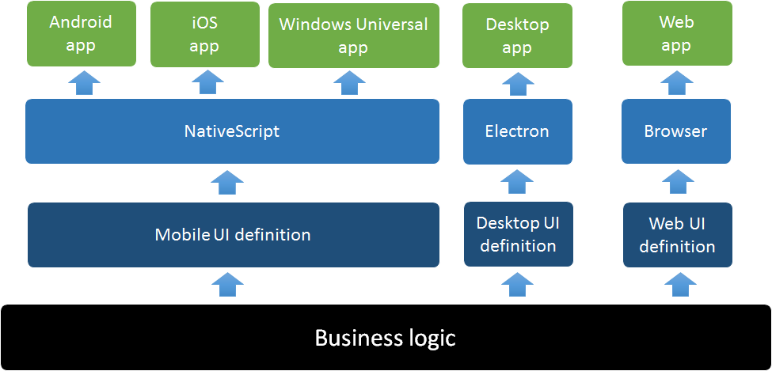
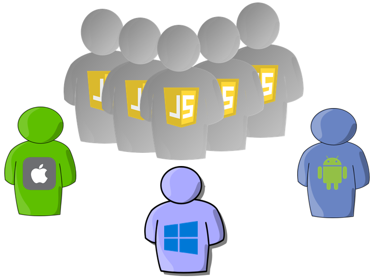

If you are in a business of building smooth and beautiful mobile apps with Native UI, like this app:


And you need an efficient way to develop for multiple platforms. Then you should take a closer look at NativeScript.

# What is NativeScript?

NativeScript is an OpenSource framework that allows you to build mobile apps with JavaScript.
Currently it has a full support for Android and iOS. As of 1.7 release (March 2016) it also includes "an early preview" support for Window Universal, which will cover both Windows Phone 10 and Windows 10.

At first sight this might seem very similar to Hybrid app development popularised by PhoneGap.
However NativeScript belongs to the JavaScript Native category of building mobile apps, where you use JavaScript to build apps with a 100% Native UI. This has a significant impact on the User Experience and Perfromance of the apps that you can build, with the outcome being almost identical to what you can achieve by building the same apps with a pure native code.

> If you are curious how a NativeScript app performs on a real device, then download **Examples NativeScript** from [Goolge Play](https://play.google.com/store/apps/details?id=org.nativescript.nativescriptmarketplacedemo) or [iTunes](https://itunes.apple.com/us/app/examples-nativescript/id1046772499?mt=8).

# Why NativeScript?

## Skills reuse
If you already know **JavaScript**, *(optionally)* **TypesScript** and **CSS**, then you already have a big chunk of skills required to build mobile apps. You don't need to learn **Objective-C**, **Swift**, **Java** and/or **C#** to target multiple platforms.

Further more if you are coming from the Angular backgroud, you coud use NativeScript with **Angular 2.0**. We will come back to this point in a moment, as this is a real game changer.

##Code reuse
With NativeScript you can take advantage of a vast array of existing **npm modules** or just plain JavaScript libraries. Just remember that there is no DOM NativeScript, so the modules cannot be browser dependant.

If you need to deal with dates, just call **npm install moment** and then you can start using it like this:
```javascript
var moment = require("moment");
var formattedTime = new moment().format("HH:mm:ss");
```

You can also import existing 3rd party Native iOS and Android libraries. This means that you are not limited to what is in NativeScript out of the box, but you can add your own Native UI components or Native libraries (i.e. to communicate with your vendors beacons).

*As an example: there is a package called* **UI for NativeScript** *, which is simply a collection of 3rd party Native (iOS and Android) UI components packaged up as NativeScript UI components.*

## Direct access to the native APIs
NativeScript gives you direct access to the Native APIs, which is a big advantage over other JavaScript Native frameworks like React Native and Appcelerator.
This means that you can call any native function or use any native type that exists in each supported platform or any imported 3rd party library.

## Open Source

The team working on NativeScript is made of around 35 people, however the whole of the framework is OpenSource and it is available to everyone for free.
You get the best of the two worlds, a great piece of technology supported by a strong dedicated team and an active OpenSource community working to push the boundries of mobile app development.

# Abstraction Layer

NativeScript lets you target multiple platforms without you having to write a single line of a platform specific code. 
This can be achieved thanks to **tns-core-modules** (available from npm) an **Abstraction Layer** that contains platform specific implementation for each supported platfrom. It provides with modules that cover many different aspects of a mobile app from **UI abstraction**, through **Device Sensors** to **Hardware Access** and many more.



Thanks to the **tns core modules** you no longer need to think on how to perform the same operation using 3 different Platform APIs, but instead you can concentrate on the what and not how.

## UI Abstraction Layer
The Abstraction Layer not only lets you share the business logic for your app, but the same applies to the UI.
This is handled by the **UI Abstraction Layer**, which lets you define the UI using tags like **Button**, **TextField**, **DatePicker** and more. For example:

```xml
<Page>
  <StackLayout>
    <Label text="Name"></Label>
    <TextField text="{{nameAttribute}}"></TextField>
    <Button text="Press Me" tap="doSomething"></Button>
  </StackLayout>
</Page>
```

Then when you build the app, each of these tags will be replaced with their native equivalents. For example **TextField** will give you:
* on Android: **android.widget.EditText**
* on iOS: **UITextField**


# Platform specific code
There might be some cases when you need to get to the platform specic code level. Like when you need to call a functionality that only exists on one platform or when you imported a 3rd party native library.

This is where the **Direct Access to the Native API** comes in to play. Like I mentioned before you can call any native function or use any native type. Just call it as if this was part of the JavaScript framework.

For example if needed to get the last modified date for a file and you had to do it with a platform specific code, then this is what your code would look like:

### for Android
```javascript
var javaFile = new java.io.File(path);
var lastModifiedDate = new Date(javaFile.lastModified());
```

### for iOS
```javascript
var fileManager = NSFileManager.defaultManager();
var attributes = fileManager.attributesOfItemAtPathError(path);
var lastModifiedDate = attributes.objectForKey(this.keyModificationTime);
```

The best thing is that this uses exactly the same namespace, attributes, types and the whole naming convention as you can find in the iOS or Android documentation. The same applies to the Native 3rd party libraries.

# Styling
NativeScript uses CSS as the styling mechanism. The implementation strictly follows the CSS specification on syntax and rules, including selectors and declarations. 

With the CSS you can define from simple things like background-color and font-size
```CSS
.small-label {
  font-size: 20;
  color: #284848;
  horizontal-align: center;
}
```
 to complex animations
```CSS
@keyframes animation {
  from { transform: none; }
  20% { transform: rotate(45); }
  50% { transform: rotate(50) scale(1.2, 1.2) translate(50, 0); }
  100% { transform: rotate(0) scale(1.5, 1.5) translate(100, 0); }
}
```

The set of properties however differs from what’s available in the web CSS since it is targeting the common denominator of three different mobile frameworks, providing different features than the HTML DOM.

# Taking it to the next level

NativeScript has been created as purely a JavaScript framework, which uses XML to define the UI and style it with CSS.
The first production ready version has been released in May 2015. Since then there have been multiple releases turning it into a very mature and robust framework.


Then Google started working on Angular 2. They came up with a completely platform agnostic architecture, which meant that Angular 2 could be used to build mobile, web, desktop or "you name it" applications. It was just a question of providing the necessary abstraction for the required platform.

Without a surprise both Google and Telerik teamed up to bring NativeScript into the Angular 2 picture. They both worked on it for almost a year now and the first production ready version is almost ready.

This means that now you have another way of using NativeScript. You can build your mobile apps just like you would an Angular 2 application. 

For example if you want to add a login screen to your app you could do it in the following steps:

### 1) Create a  UserService class, which will contain the code to login.

```JavaScript
import {Injectable} from "angular2/core";

@Injectable()
export class UserService {
  login(userName: String, password: String) {
    return doSomeMagicHereAndReturnPromise();
  }
}
```

### 2) Next we need to create an Angular UI component, which will do few things:
  * Inject the UserService(created in the previous step) component. See the constructor,
  * Expose the login function from the UserService and do something on success or error,
  * Assign templateUrl to an HTML file containing the UI definion

```JavaScript
import {UserService} from "./user.service";

@Component({
  selector: "my-app",
  providers: [UserService],
  templateUrl: "pages/login/login.html"
})
export class LoginPage {
  userName: String;
  password: String;

  constructor(private _userService: UserService) {
    this.username = "user@nativescript.org";
    this.password = "password";
  }

  login() {
    this._userService.login(this.username, this.password)
      .subscribe(
        () => doSomethingOnSuccessfulLogin(),
        (error) => alert("Unfortunately we could not find your account.")
      );
  }
}
```

### 3) Finally we need to define the UI template. Here we need:
* a couple of text fields that are bound to **username** and **password**
* a sign in button that will call **login()** on tap

```HTML
<StackLayout>
  <Image src="res://logo_login" stretch="none" horizontalAlignment="center"></Image>
  <TextField hint="Email Address" [(ngModel)]="username"></TextField>
  <TextField hint="Password" secure="true" [(ngModel)]="password"></TextField>
  <Button [text]="Sign in" (tap)="login()"></Button>
</StackLayout>
```

With a bit of extra styling the Login Screen should look something like this:


> Reword this somehow
Angular 2 provides the architecture and mechanisms for the application logic to communicate with the UI components, while NativeScript provides the mechanism to interact with the Native APIs and Native UI components.
>You get the best of the two worlds: NativeScript's access to the Native UI and API and Angular's mechanisms.


# How does this change your mobile strategy

## The bigger picture > Mobile/Web/Desktop


## Dev team setup


# Other 
## Getting started pointers -> http://docs.nativescript.org/getting-started
## Performance – Native UI ???
